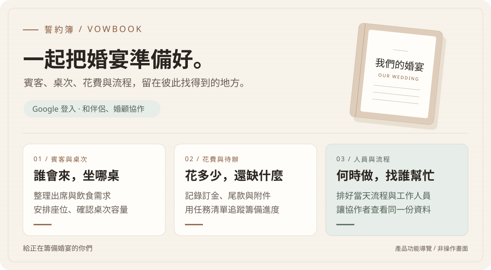

# 誓約簿 VowBook

**把賓客、桌次和花費整理好，和伴侶一起準備婚宴。**

VowBook 是給新人、伴侶與婚顧使用的婚宴規劃網站。從確認誰會來、安排坐哪桌，到記錄訂金、待辦與當天流程，都能放在同一個婚宴工作區，讓一起籌備的人查看與更新。

A wedding planning app for couples and planners to manage guests, seating, budgets, and timelines together. Available as a hosted service or for self-hosting.

[開啟 VowBook](https://ycspace.myvnc.com/VowBook) · [查看功能](#功能) · [本機開發](docs/development.md#本機開發) · [給開發者與 AI](#給開發者與-ai)

<picture>
  <source media="(max-width: 600px)" srcset="docs/assets/product-overview-mobile.svg">
  
</picture>

*功能導覽示意圖；下方有完整文字說明。*

## 籌備婚宴時，這些事可以放在一起

### 01 ／ 名單與座位一起整理

親友會來幾位、需不需要素食或兒童椅，先記在賓客名單。安排桌次時可以查看容量與尚未入席的賓客，減少在人名表與座位表之間來回核對。

### 02 ／ 花費與待辦有地方追蹤

婚紗、場地與婚禮小物各花了多少，訂金付了沒、尾款還剩多少，都能按項目整理。把要完成的事列進任務清單，再為每項工作設定到期日。

### 03 ／ 和伴侶、婚顧共用一份資料

各自用 Google 帳號登入同一個工作區，查看任務、聯絡名單與婚禮流程。需要協助編輯的人給編輯權限，只需參考的人則設為檢視者。

## 功能

公開原始碼與內部版共用相同產品程式碼；兩者對應同一個正式站，部署設定依環境管理。

| 功能 | 可以做什麼 |
| --- | --- |
| **賓客** | 整理出席、人數、素食與兒童椅需求；新郎與新娘家人分欄，依輩份排列。 |
| **工作人員與廠商列印** | 工作人員清單包含便當葷素、紅包金額與分別發放勾選；廠商尾款清單列出未清尾款、聯絡資訊、期限與付款勾選。 |
| **紙本禮金簿** | 沿用同一家人設定，涵蓋各種出席狀態的受邀親友，排除新人、雙方父母手足與已標記不收禮金者，未登記者金額留白供手寫，已登記的家庭標示「禮金已收訖」而不印金額；可列印或另存 PDF。 |
| **發餅名單** | 共同出席者可合併為同一家，依新郎／新娘親友分類，列印含姓名、稱謂、盒數與領取勾選欄的名單，或另存 PDF。 |
| **報到與禮金** | 登記到場人數與禮金，標記不收禮金但送餅，追蹤禮到人不到的回禮。 |
| **桌次** | 安排賓客入席、檢查桌次容量，編排場地平面配置與列印座位圖；可列印招待帶位名單，包含同行人數、素食、兒童椅與勾選欄，未排桌親友另列。 |
| **任務** | 列出待辦、設定到期日，追蹤進行中與已完成的事項。 |
| **花費** | 按分類記錄訂金、尾款與付款狀態，將報價、收據或合約附件放在對應項目。 |
| **工作人員** | 整理角色、聯絡方式、紅包與便當，透過總召交辦清單分派事項並關聯流程。 |
| **總流程** | 排好婚禮當天的時間、地點、內容與工作人員，依需要套用午宴流程範本。 |
| **協作者** | 邀請伴侶、婚顧或檢視者加入；由擁有者管理成員角色與存取權。 |

花費附件與桌次平面配置包含在各自的功能內。支援的花費附件為 PDF、JPEG、PNG 與 WebP，單檔上限 10 MiB。

## 如何開始

1. 開啟 [VowBook](https://ycspace.myvnc.com/VowBook)，使用 Google 帳號登入。
2. 建立婚宴工作區，填入婚宴的基本資訊。
3. 先整理賓客、花費或任務，依自己的籌備進度逐步補齊。
4. 由工作區擁有者建立協作邀請，讓對方使用受邀的 Google 帳號加入。

使用線上服務不需要自行安裝。想自行保管與維護服務，可參考 [開發與自架指南](docs/development.md)；自架需要 PostgreSQL、Google OAuth 設定與 HTTPS 服務環境。

## 誰可以查看與修改

每場婚宴有自己的工作區，只有加入該工作區的成員才能存取。成員以各自的帳號協作。

| 角色 | 婚宴資料 | 邀請與管理成員 |
| --- | --- | --- |
| 擁有者 `OWNER` | 查看與編輯 | 可以 |
| 伴侶 `PARTNER` | 查看與編輯 | 不可以 |
| 婚顧 `PLANNER` | 查看與編輯 | 不可以 |
| 檢視者 `VIEWER` | 僅查看 | 不可以 |

伺服器每次讀寫都會檢查目前帳號的成員權限。下述一次性離線匯入另有操作者授權限制，不是網站登入方式。

## 使用前先知道

- **出席回覆由籌備者管理。** 目前沒有提供賓客自行填寫的公開 RSVP 表單，也不會自動寄送喜帖、邀請信或提醒信。
- **協作邀請與賓客邀請不同。** 前者讓伴侶或婚顧加入工作區；建立一筆賓客資料不會邀請該賓客登入。
- **花費用來記帳與追蹤。** 標示已付訂金或已付清，不會替你執行付款。
- **匯入工具需由操作者執行。** LINEIN RSVP 與 Notion 花費工具只處理經 OWNER 授權的一次性離線匯入，不會自動連線來源服務，也沒有排程或雙向同步。

## 給開發者與 AI

想快速了解專案，可以先讀 [產品與程式索引](docs/product-context.md)。它列出功能對應的路由、資料模型與程式入口，也說明容易混淆的名詞及尚未提供的能力。

| 想了解的內容 | 文件 |
| --- | --- |
| 產品範圍、功能與程式入口 | [產品與程式索引](docs/product-context.md) |
| 環境設定、架構與驗證命令 | [開發與自架指南](docs/development.md) |
| 參與開發 | [CONTRIBUTING.md](CONTRIBUTING.md) |
| 回報安全問題 | [SECURITY.md](SECURITY.md) |

技術組成：Next.js 16 App Router、React 19、TypeScript、Tailwind CSS 4、NextAuth 4 Google OAuth、PostgreSQL 與 Prisma 6；測試使用 Vitest、Testing Library 與 Playwright。實際版本和命令以 [package.json](package.json) 為準。

## 參與與授權

一般錯誤與功能建議可至 [GitHub Issues](https://github.com/NickYCLin/vowbook/issues) 回報；請勿附上真實賓客資料。安全問題請依 [安全政策](SECURITY.md) 回報。

除另有註明外，原始碼依 [Mozilla Public License 2.0](LICENSE) 授權。VowBook 名稱、Logo 與品牌識別不因本授權授予商標權。
